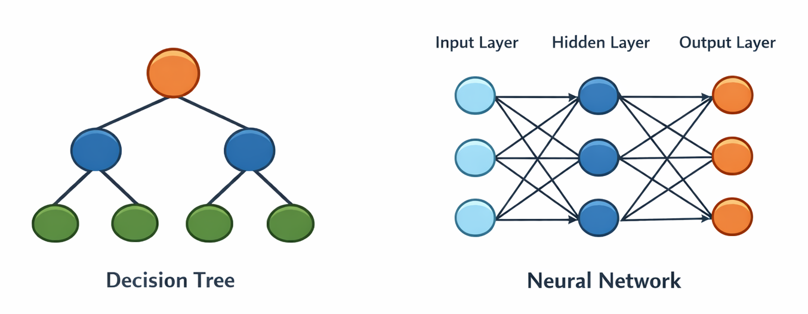
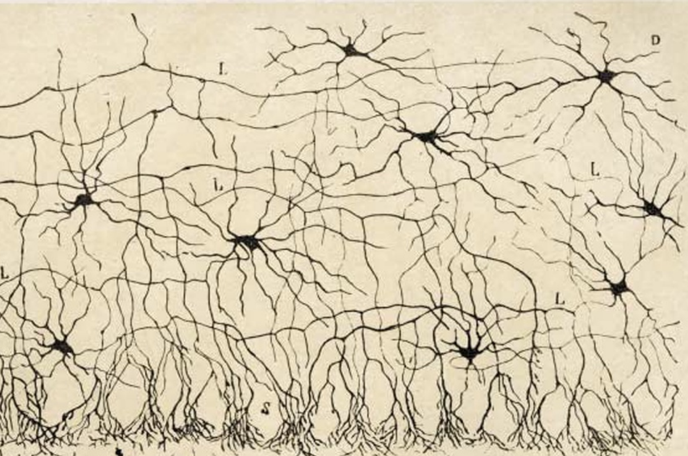

### Two Ways of Thinking About AI
In the previous section, we saw that we could use a random forest classifier to predict the species of a penguin from its beak measurements. This is sometimes called **symbolic AI** because the computer follows explicit rules that humans can read and understand.

A neural network takes a different approach. Like a decision tree, a neural network learns which rules to apply to the features from the training data. However, unlike a decision tree, it also learns which inputs or combinations of inputs to apply these rules to - effectively, it learns its own features.

::: {.callout-tip}
This can be very powerful - e.g. vision or language models can learn to pick out important features in the data that are hard to encode otherwise, like semantic meaning ("my dog bit his *lead*" vs "there is *lead* in the water supply") in text or texture/shape of objects in images, but generally require more training data and computational power than simpler models. Generally decision trees are good enough for tabular data, because your table's columns are already meaningful features.
:::

**Both can solve the same problem, but they "think" differently!**

| &nbsp;               | Decision Tree                                | Neural Network                      |
|----------------------|----------------------------------------------|-------------------------------------|
| **Features**         | You provide them (beak length, flipper size) | It learns its own internal features |
| **Rules**            | Explicit and readable ("if beak > 18mm...")  | Hidden in millions of numbers       |
| **Interpretability** | You can explain every decision               | Often a "black box"                 |

### What is a Neural Network, Really?

At its core, a neural network is just a **mathematical function**.

It takes some **inputs** (numbers representing your data) and produces some **outputs** (numbers representing predictions).

### The "Neural" Part

The function is made up of layers of simple computational units (loosely inspired by biological neurons). Each unit:

1. Takes inputs from the previous layer
2. Multiplies them by **weights** (importance factors)
3. Adds a **bias** (a nudge in one direction)
4. Applies an **activation function** (adds non-linearity)

The "learning" happens when we adjust those weights and biases so the network's outputs get closer to the correct answers.

The neural network is made up of several of these neurons each of which are connected to all the others in the neighbouring layers (hence, neural **network**).

{width="60%"}

### Three Ways to Work with Neural Networks

When building AI applications, you have three options:

#### 1. From Scratch (The Hard Way)
Write all the maths yourself-matrix multiplications, gradient calculations, weight updates. Educational, but tedious and error-prone.

#### 2. Using a Framework
Use tools like **PyTorch** or **TensorFlow** that handle the complex maths while giving you control over the architecture. **This is what we'll do today.**

#### 3. Using Pre-built Models (The Quick Way)
Download a model someone else trained (like GPT, ResNet, or BERT) and use it directly or fine-tune it for your task. Great when you don't have much data or compute or when models to solve your problem already exist.

 

We'll use **PyTorch** because it's:

- Intuitive and "Pythonic"
- The most popular framework in research
- Excellent for learning how neural networks actually work
