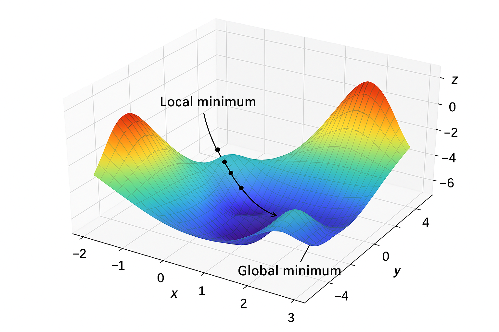

```{python}
#| echo: false
#| output: false

# First, let's import PyTorch
import torch

print(f"PyTorch version: {torch.__version__}")
print(f"GPU available: {torch.cuda.is_available()}")

from torch import nn

from torchview import draw_graph


class SimpleClassifier(nn.Module):
    """
    A simple multi-class classifier

    """

    def __init__(self, input_size, hidden_sizes, num_classes):
        super().__init__()

        # The layers with weights and biases
        self.layer_sizes = [input_size, *hidden_sizes, num_classes]
        self.layers = nn.ModuleList(
            [nn.Linear(i, o) for (i, o) in zip(self.layer_sizes[:-1], self.layer_sizes[1:])]
        )

        # Activation function (adds non-linearity)
        self.relu = nn.ReLU()

    def forward(self, x):
        """This defines how data flows through the network"""
        # We have layer -> activation -> layer -> activation -> ...
        # up until the last layer of the network, for which there is
        # no activation
        for layer in self.layers[:-1]:
            x = layer(x)
            x = self.relu(x)
        return self.layers[-1](x)


# Create an instance: 4 inputs, 8 hidden neurons, 3 output classes
model = SimpleClassifier(
    input_size=4,
    hidden_sizes=[8, 12, 8],
    num_classes=3,
)


total_params = sum(p.numel() for p in model.parameters())

fake_input = torch.tensor([[5.1, 3.5, 1.4, 0.2]])

# Pass it through the network
output = model(fake_input)


# Convert to probabilities using softmax
probabilities = torch.softmax(output, dim=1)
```


### Training on Real Data: Iris Classification

Now let's train our network on the classic **Iris dataset** (150 samples, 4 features, 3 classes).

### The Training Loop

Every training loop follows the same pattern:

1. **Forward Pass** -> Compute predictions
2. **Compute Loss** -> Measure how wrong we are (using CrossEntropyLoss for classification)
3. **Backward Pass** -> Calculate gradients via backpropagation (`loss.backward()`)
4. **Update Weights** -> Adjust parameters using the optimizer (`optimizer.step()`)

### Forward Pass
We have already seen the code for the forward pass above - it is what we use to make predictions.

It looks like:

```python
predictions = model(inputs)
```

### Computing loss
The loss functions tells us how wrong we are. Since our classification task is a multi-class classification problem, `CrossEntropyLoss` is a simple and standard choice but [many alternatives](https://docs.pytorch.org/docs/stable/nn.html#loss-functions) exist.

To calculate the loss, we need to initialise our loss function object:

```python
criterion = nn.CrossEntropyLoss()
```

and use it in the training loop:

```python
loss = criterion(predictions, true_labels)
```

### Backward Pass
The backward pass is where the "magic" of the neural network happens.

As you might have noticed above, neural networks have a LOT of parameters. How can we possibly train this? You might be familiar with optimisation algorithms like the simplex method or Newton-Raphson: these work well in theory but become extremely slow when optimising more than a handful of parameters. Neural networks overcome this using **backpropagation**, which is essentially an efficient application of the chain rule from calculus. Because every operation in the network (including non-linear activations like ReLU) has an easily computed derivative, we can calculate how the loss changes with respect to every parameter in the network. This tells us exactly how to adjust each weight and bias to reduce the loss.

### Update Weights
Once we have the gradients from backpropagation, we need to actually update the weights. This is done by an **optimizer**. The simplest approach is **gradient descent**: move each parameter a small step in the direction that reduces the loss.

```python
optimizer = torch.optim.Adam(model.parameters(), lr=0.01)
```

The learning rate `lr` controls how big the step is - too small and training takes forever; too big and you might overshoot the minimum.



In the training loop we call:

```python
optimizer.zero_grad()  # Clear gradients from the previous step
loss.backward()        # Compute new gradients
optimizer.step()       # Update weights using those gradients
```

PyTorch provides many optimizers beyond basic gradient descent. Adam (used above) is a popular choice that adapts the learning rate for each parameter, often converging faster than vanilla gradient descent.


### A Real Example

```{python}
# Load the Iris dataset from sklearn
from sklearn.datasets import load_iris
from sklearn.model_selection import train_test_split
from sklearn.metrics import confusion_matrix, ConfusionMatrixDisplay
import matplotlib.pyplot as plt
from torchview import draw_graph

# Load the data
iris = load_iris()
X, y = iris.data, iris.target

# Split into training and test sets
X_train, X_test, y_train, y_test = train_test_split(
    X, y, test_size=0.2, random_state=42, stratify=y
)

# Convert to PyTorch tensors
X_train_t = torch.tensor(X_train, dtype=torch.float32)
X_test_t = torch.tensor(X_test, dtype=torch.float32)
y_train_t = torch.tensor(y_train, dtype=torch.long)
y_test_t = torch.tensor(y_test, dtype=torch.long)

print(f"Training samples: {len(X_train_t)}, Test samples: {len(X_test_t)}")
print(f"Features: {X_train_t.shape[1]}, Classes: {len(iris.target_names)}")

# Define loss function and optimizer
criterion = nn.CrossEntropyLoss()  # For multi-class classification
optimizer = torch.optim.Adam(model.parameters(), lr=0.005)

# Training loop
num_epochs = 250
losses = []

print("\nTraining...")
for epoch in range(num_epochs):
    # Forward pass: compute predictions
    outputs = model(X_train_t)

    # Compute loss
    loss = criterion(outputs, y_train_t)
    losses.append(loss.item())

    # Backward pass: compute gradients
    optimizer.zero_grad()  # Clear previous gradients
    loss.backward()  # Compute gradients via backpropagation

    # Update weights using the optimizer
    optimizer.step()

    # Print progress every 20 epochs
    if (epoch + 1) % 20 == 0:
        print(f"Epoch [{epoch + 1}/{num_epochs}], Loss: {loss.item():.4f}")


model_graph = draw_graph(model, input_size=(1, 4))  # (batch_size, input_size)
model_graph.visual_graph
```


We have now trained our neural network!

Now that the model has been trained, the weights and biases have changed. Compare the image above to the original, untrained model.


### Monitoring training

During training, we expect our loss to decrease as the model makes better and better predictions. You might have noticed above that the neural network "sees" the entire dataset multiple times - each of these is known as an "epoch". We can plot the loss against epoch number to see how the model improves:


```{python}
# Plot the training loss
plt.figure(figsize=(10, 4))
plt.subplot(1, 2, 1)
plt.plot(losses)
plt.xlabel("Epoch")
plt.ylabel("Loss")
plt.title("Training Loss Over Time")
plt.grid(True)
```

